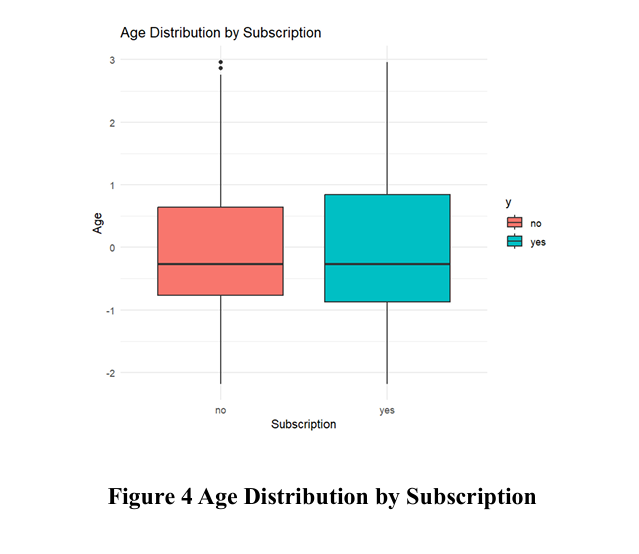
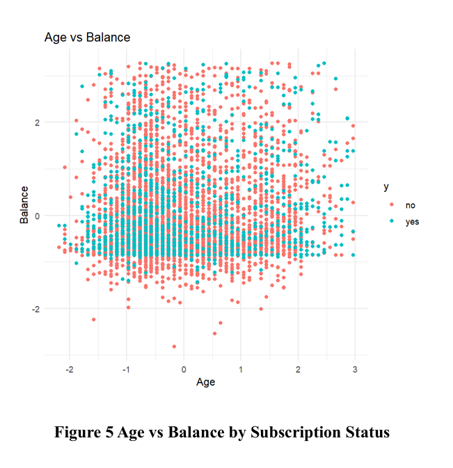
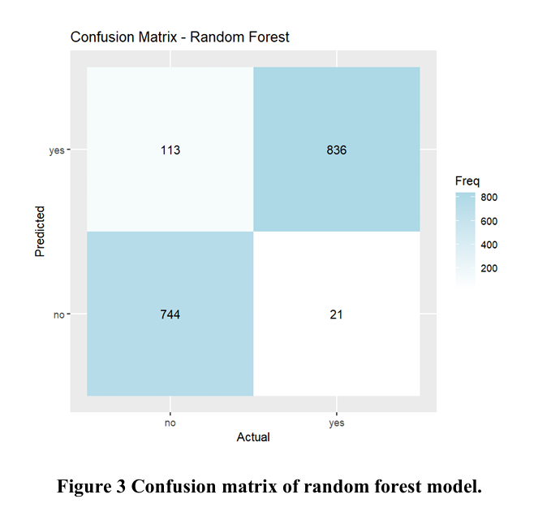
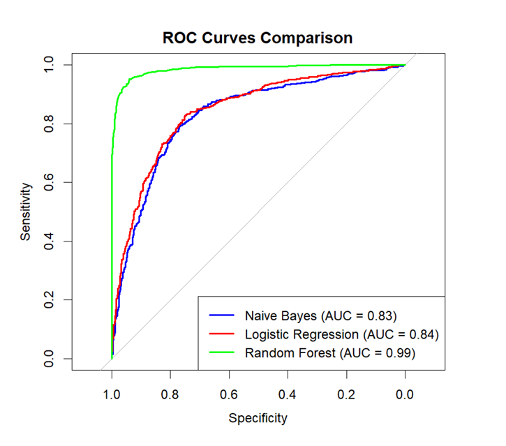
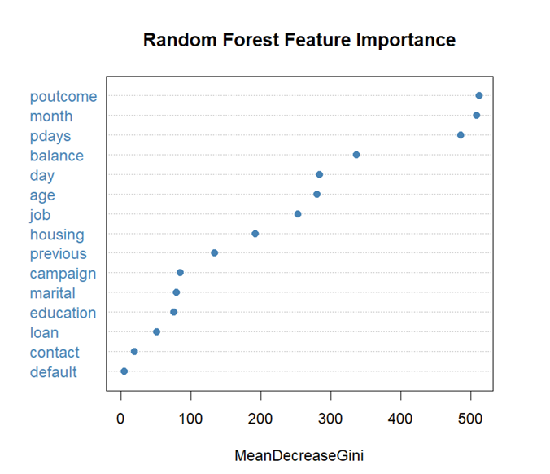

 # Bank Marketing Prediction Using Machine Learning

## Project Overview

This project applies machine learning to predict whether a bank customer will subscribe to a term deposit following a marketing campaign.

The analysis uses customer demographic, financial and campaign-related information from the Bank Marketing dataset. The project covers data cleaning, preprocessing, exploratory data analysis, class balancing, model development and evaluation.

Three classification models were compared:

- Naive Bayes
- Logistic Regression
- Random Forest

Random Forest produced the strongest overall performance among the three models.

## Business Objective

Bank marketing campaigns can involve contacting large numbers of customers, many of whom may not be interested in the product being offered.

The objective of this project is to use historical customer and campaign data to identify patterns associated with term deposit subscription and evaluate machine learning models that could help improve customer targeting.

## Dataset

The project uses the Bank Marketing dataset from the UCI Machine Learning Repository.

- **Records:** 45,211
- **Original variables:** 16 independent variables and 1 target variable
- **Target:** `y`
- **Target classes:** `yes` and `no`
- **Positive subscription rate:** approximately 11.3%

The variables contain information relating to customer demographics, financial circumstances and previous/current marketing contacts.

The raw dataset is not included in this repository. Instructions for obtaining it are available in the `data/` folder.

## Tools & Technologies

- R
- ROSE
- Machine Learning
- Random Forest
- Logistic Regression
- Naive Bayes
- Exploratory Data Analysis (EDA)
- Data Preprocessing
- Model Evaluation
- Data Visualisation

## Data Preparation

Several preprocessing steps were performed before modelling:

- Replaced categorical `"unknown"` values with missing values
- Removed incomplete observations
- Checked for constant columns
- Removed the `duration` variable because call duration is only known after the marketing call and may introduce information leakage
- Identified and removed numerical outliers using the IQR method
- Converted categorical variables to factors
- Standardised numerical variables
- Addressed target-class imbalance using oversampling with ROSE

Target-class imbalance was addressed using ROSE oversampling, after which the prepared dataset was divided into training and testing sets using an 80/20 split.

## Exploratory Data Analysis

### Age Distribution by Subscription

The age distributions of subscribers and non-subscribers were relatively similar, suggesting that age alone was not a strong differentiator of subscription behaviour.

### Age and Account Balance

Age and account balance did not provide clear separation between subscribers and non-subscribers, suggesting that subscription behaviour depends on a combination of customer and campaign characteristics.

## Machine Learning Models

Three supervised classification models were evaluated:

### Naive Bayes

A probabilistic baseline model suitable for classification problems involving a mixture of customer characteristics.

### Logistic Regression

An interpretable binary classification model used to provide a second baseline for predicting subscription outcomes.

### Random Forest

An ensemble tree-based model capable of capturing more complex relationships between customer and campaign variables.

## Model Performance

| Model | Accuracy | Precision | Recall | F1 Score | AUC |
|---|---:|---:|---:|---:|---:|
| Naive Bayes | 77.36% | 77.30% | 77.48% | 77.39% | 0.830 |
| Logistic Regression | 77.54% | 79.35% | 74.45% | 76.82% | 0.844 |
| Random Forest | **92.18%** | **88.09%** | **97.55%** | **92.58%** | **0.985** |

Random Forest achieved the strongest performance across the main evaluation metrics.

### Random Forest Confusion Matrix

### ROC Curve Comparison

The ROC analysis further demonstrated the difference between the models. Random Forest achieved an AUC of approximately 0.99, compared with approximately 0.84 for Logistic Regression and 0.83 for Naive Bayes.

## Feature Importance

Random Forest feature importance showed that campaign-related variables played an important role in predicting term deposit subscription.

The most influential variables included:

- `poutcome` - outcome of the previous marketing campaign
- `month` - month of contact
- `pdays` - number of days since the customer was previously contacted

Account balance, contact day and customer age also contributed to prediction, while several demographic variables showed comparatively lower importance.

## Key Findings

- Random Forest substantially outperformed Naive Bayes and Logistic Regression in this analysis.
- Random Forest achieved 92.18% accuracy and an AUC of 0.985.
- Its recall of 97.55% indicates strong identification of customers belonging to the positive subscription class.
- Previous campaign outcome, contact month and time since previous contact were among the most influential predictors.
- Campaign-related information appeared more influential than several basic demographic characteristics.
- Age and account balance alone did not clearly separate subscribers from non-subscribers.

## Repository Structure

- `data/` - dataset information and source instructions
- `r/` - R analysis and machine learning code
- `images/` - analysis and model visualisations
- `report/` - complete project report

## Key Skills Demonstrated

R · Machine Learning · Classification · Data Cleaning · Exploratory Data Analysis · Class Imbalance Handling · Model Evaluation · Random Forest · Logistic Regression · Naive Bayes · Data Visualisation

## Full Report

The complete project report, including the methodology, literature review, analysis, model results and discussion, is available in the `report/` folder.
